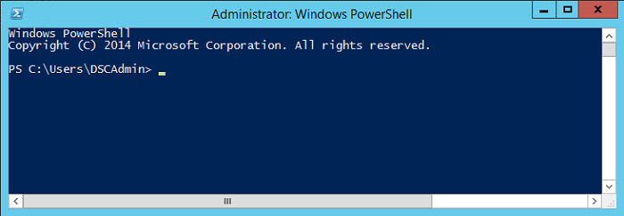
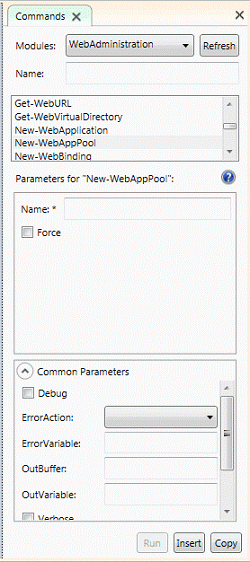
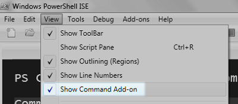
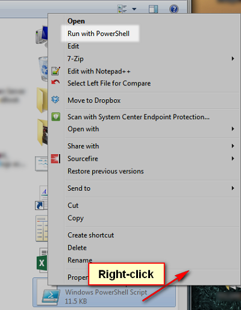

[VISUAL STUDIO ALM RANGERS](http://aka.ms/vsaraboutus)
 ---

| [README](./README.md) | [Setting the context for PowerShell DSC](./Setting the context for PowerShell DSC.md) | [Interesting Questions and Answers](./Interesting Questions and Answers.md) | [Walkthrough - File Server & Share Custom Resource](./Building and sharing a custom resource walkthrough.md) | [Walkthrough - Deploy TFS 2013 using DSC](./Deploy TFS 2013 using DSC.md) | 

| Appendix [PowerShell 101](./Getting started with PowerShell.md) | [Scenario - Deploy a website using MSDeploy](Scenario - Deploy a website using MSDeploy.md) | [Scenario - Deploying a database using DacPac](./Scenario - Deploying a database using DacPac.md) | [Scenario - TFS 2013 on a single ATDT server](./Scenario - TFS 2013 on a single ATDT server.md) |

# Appendix – PowerShell 101

This section aims at giving a taste of PowerShell™ so the reader can more easily grasp the following chapters and be able to look at the proper reference material when needed.

## First impact

We think that the easiest way to understand Windows PowerShell™ is to start with some quick examples.

Let’s open a Windows PowerShell command prompt: press the  key, start typing ”power” and select Windows PowerShell. Now, you should see a window like shown below.



*Figure 1 – Windows PowerShell™ interactive*

Now you can type a command like **dir**:

```console
PS C:\Users\Administrator> dir
    Directory: C:\Users\Administrator
Mode                LastWriteTime     Length Name
----                -------------     ------ ----
d-r--         22-May-14   7:08 PM            Contacts
d-r--         03-Jun-14   7:32 PM            Desktop
…
```

While this output resembles the one from Command Prompt’s native dir command, in reality it is quite different, because PowerShell commands return objects, not strings.

Let us demonstrate:

```console
PS C:\Users\Administrator> dir | sort LastWriteTime
    Directory: C:\Users\Administrator
Mode                LastWriteTime     Length Name
----                -------------     ------ ----
-a---         21-Feb-14   6:02 PM        114 .gitconfig
d-r--         22-May-14   7:08 PM            Contacts
d-r--         22-May-14   7:08 PM            Favorites
…
```

The output of the dir command is piped into the sort command, which takes an argument that states, which object’s property orders the result. Therefore, we discovered that commands might take arguments by position, which is not a big surprise; we can explicitly name the arguments, the name precedes the value and a dash (minus sign) marks it.

If you look carefully, the sort order is based on the property’s *value*, in this case a date, not on the string representation. This is a critical difference from other environments, as you do not have to jump through hoops to parse strings and maybe the strings changes depending on locale.

The use of the pipe sign is not original to PowerShell, as we use it in most command line shells: DOS, CMD, bash, csh, etc. It means to transfer the *objects* generated in output by the left command, to the next command on the right of the pipe. PowerShell is smart enough to optimize object generation through the pipeline: instead of waiting for the first command to complete and produce a bunch of objects; as soon as one object is ready, it is passed to the next command and so on.

## A Language

Make no mistake, PowerShell is a full-blown programming language; see
this example.

```console
PS C:\Users\Administrator> $files = dir
PS C:\Users\Administrator> foreach ($f in $files) {
    if ($f.LastWriteTime -gt ((Get-Date) - (New-TimeSpan -Days 7))) {
        write $f.Name

    }
}

Desktop
Documents
Downloads
Videos
```

This code loops through the files in the current directory and outputs the name of files changed in the last seven days. Let us examine this code more carefully.

As you probably guessed, the dollar sign ($) prefixes variables, so the first line stores the output from the dir command into the variable “files.”

The next line is more interesting, it states to loop through the content of the files variable, setting the f variable to the current item. Curly brackets ({}) groups commands and PowerShell has the usual set of control statements: if/else for testing a condition, for and foreach to loop over a sequence of objects, while to conditionally loop, switch branch on a value, break, continue and return to control exit from deep nesting.

The loop body is an if statement with a complex condition:

```console
$f.LastWriteTime -gt (
    (Get-Date) - (New-TimeSpan -Days 7)
)
```

It can be translated as pick current date, subtract seven days and compare with LastWriteProperty of the object stored in f variable, and return true if property value is more recent. In other words, gets the files changed in the last seven days.

The snippet has an interesting construct: **-gt**, in a place where a greater than symbol (\>) is normally used. Surprising for a developer but not for an administrator: \> and \< are reserved to redirect output and input, respectively. That´s the hardest habit to gain for programmers: stop typing angular brackets!

The minus (or dash) sign introduces a number of *operators*: -eq and -ne for equality and inequality, -gt, -ge, -lt, -le for comparison, -not, -and, -or, and-xor for logic (! is short for -not),-contains, -notcontains,-in, -notin for containment test, -like, -notlike and-match, -notmatch for string pattern matching. There are more operators, but this list a good starting point.

**Get-Date** and **New-TimeSpan** are two *cmdlets* that are two natural PowerShell commands. The first returns the current date and time, the latter a time interval.

The dot notation to access an object property should not be a surprise.
Practically all modern languages use it.

You may use a different approach in your code, with identical result.

```console
PS C:\Users\Administrator> dir | where {
>> $_.LastWriteTime -gt ((Get-Date) - (New-TimeSpan -Days 7))
>> } | select Name
>>
Name
----------
Desktop
Documents
Downloads
Videos
```

This style leans heavily on pipelining commands, and we see this often in practice, so, our suggestion is to get used to reading both styles.

The automatic variable **$\_** represent the current item in the loop, like f in the previous example. The where command is interesting. Instead of testing the condition and the explicitly outputting an object, it filters which object passes the condition and move them downstream the pipeline. Last element is the select command, it projects some properties of the incoming objects in the output; you may say, it creates new objects on the fly based on the input. There is subtle difference, in fact, with the previous example the output is a series of objects with a single property Name; in the first case, we get a sequence of strings. You may easily spot the difference as the second result is formatted as a single-column table.

## Exploring the field

We sloppily used the term command: the proper word is *cmdlet*. It is packed functionality written in some language (could be C\#, VB.Net, or even PowerShell itself) that takes a number of parameters to realize some action. It is light in the sense that we run the cmdlets’ code inside the PowerShell interpreter, without creating a new process.

Every new PowerShell version adds more cmdlets covering more Windows areas: PowerShell 4.0 in Windows 2012 R2 reaches more than 500 cmdlets. You can imagine the space it would take describing them all in details! A better approach is teaching you to fish, a proper metaphor, in the sea of cmdlets to find what you need, when you need it.

We organize Cmdlets in modules, each module covering a specific area; for example, the *WebAdministration* module permits to control most IIS objects like web sites or bindings.

To get information about modules use the **Get-Module** cmdlet. For example, a list of modules installed on the system:

```console
PS C:\Users\Administrator> Get-Module -ListAvailable | select Name
```

The list of cmdlets contained in a module is easy to retrieve

```console
PS C:\Users\Administrator> Get-Command -Module WebAdministration
```

The **Get-Command** is much more flexible; you can search names using wildcards

```console
PS C:\Users\Administrator> Get-Command *apppool*
```

Notice the Verb-Object style of cmdlets: it does not happen by chance, instead is an important convention that helps finding and using commands. The range of verbs is controlled, large (around 100), but not arbitrary.

```console
PS C:\Windows\system32> Get-Verb
```

This list goes on and on with seven contexts (groups): Common, Data, Lifecycle, Diagnostic, Communications, Security, and Other; this simply means that a verb like Connect will work in a communication context, e.g. **Connect-PSSession**, while a verb as Add can be found in any context, from **Add-AzureAccount** to **Add-WebConfigurationProperty**.

Recapping, you can navigate top-down and find a command that can be interesting. Now we need to discover how a command works and what data requires? The answer is easy: use the question mark option.

```console
PS C:\Users\Administrator> dir -?
NAME
    Get-ChildItem
SYNTAX
    Get-ChildItem [[-Path] <string[]>] [[-Filter] <string>] [-Include <string[]>] [-Exclude <string[]>] [-Recurse]
    [-Force] [-Name] [-UseTransaction] [-Attributes <FlagsExpression[FileAttributes]> {ReadOnly | Hidden | System |
    Directory | Archive | Device | Normal | Temporary | SparseFile | ReparsePoint | Compressed | Offline |
    NotContentIndexed | Encrypted | IntegrityStream | NoScrubData}] [-Directory] [-File] [-Hidden] [-ReadOnly]
    [-System]  [<CommonParameters>]
    Get-ChildItem [[-Filter] <string>] -LiteralPath <string[]> [-Include <string[]>] [-Exclude <string[]>] [-Recurse]
    [-Force] [-Name] [-UseTransaction] [-Attributes <FlagsExpression[FileAttributes]> {ReadOnly | Hidden | System |
    Directory | Archive | Device | Normal | Temporary | SparseFile | ReparsePoint | Compressed | Offline |
    NotContentIndexed | Encrypted | IntegrityStream | NoScrubData}] [-Directory] [-File] [-Hidden] [-ReadOnly]
    [-System]  [<CommonParameters>]
ALIASES
    gci
    ls
    dir
REMARKS
    Get-Help cannot find the Help files for this cmdlet on this computer. It is displaying only partial help.
        -- To download and install Help files for the module that includes this cmdlet, use Update-Help.
        -- To view the Help topic for this cmdlet online, type: "Get-Help Get-ChildItem -Online" or
           go to http://go.microsoft.com/fwlink/?LinkID=113308.
```

First, we discover that **dir** is not a primitive PowerShell cmdlet, but it is an alias for **Get-ChildItem**, allowing us todisguise all cmdlets in a short, easy-to-type form. It is also a best practice to avoid using alias in source code, but writing the full cmdlet game.

The ending part is very interesting and shows how to get a more detailed help for the command.

The bulk of the output resolves in explaining which parameters the cmdlet accepts and the range of values admitted for each. You may have noticed that some arguments work as a switch, i.e. do not get any additional value but their sole presence alter the cmdlet behavior,–Recurse is an example.

PowerShell comes with a bare minimum help information you should refresh with latest additions and edits through this command.

```console
PS C:\Users\Administrator> Update-Help
```

After this, we have more content for dir/Get-ChildItem.

```console
PS C:\Users\Administrator> Get-Help dir
```
   	

With this latest we have complete information to understand what the cmdlet does and the meaning of the options, but what about the output, the results flowing from it?

PowerShell is a ***reflective*** environment, which means you have PowerShell commands to get information on any object, a capability similar but more powerful than .Net reflection. Let us see this in action on the output of dir/Get-ChildItem.

```console
PS C:\Users\Administrator> dir | Get-Member
```

Now, we know that **Get-ChildItem** returns objects of type System.IO.DirectoryInfo *and* of System.IO.FileInfo type, both well known to .Net developers. This reinforces what we said some pages above: PowerShell works with objects not basic strings.

**Get-Member** exposes all native properties and methods plus some. Yes, PowerShell adds supplemental information to ease object manipulation in scripts. They are easy to spot in the above listing:

- NoteProperties are additional read-only data, ScriptProperties are dynamic properties that we write in PowerShell, and CodeProperties are dynamic code that we write in .Net, similar to C\# extension methods. 
- You can explore this and additional categories in the on-line documentation.

### ISE

Suppose you are tired of all this typing, so it is time to learn a bit about PowerShell ISE (Integrated Scripting Environment, the tool that helps you writing and debugging code.

The most prominent feature for a newbie is the **Command Add-on** depicted in the following figure. From this panel you can navigate the modules installed on the system, find cmdlets, understand their options, and so
on



*Figure 2 – Command panel*

The three buttons at the bottom allows you to compose a command, run, or copy it. The command panel appears only when we enable the “Show Command Add-on” option.



*Figure 3 – Show Command Add-on Option*

## Packing up

So far, we worked interactively at the command line, now it is time to say something about scripting. You may avoid typing every time the same PowerShell code by saving it in a text file with the .ps1 extension.

Take the following code:

```powershell
Get-ChildItem "$env:SystemDrive\" -File -Recurse -ErrorAction SilentlyContinue | where { $_.Length -ge 100MB }
```

It scans the system drive to find any file bigger than 100 MB. Note the use of $env:SystemDrive which resolves in the %SystemDrive% environment variable, usually the C: drive.

### Scripts

Save this code in a file named **findBigFiles.ps1** in your home directory,
e.g. C:\\Users\\Administrator. To run it you can:

- Select “Run with PowerShell” from Windows Explorer’s context menu.
- Type the path, relative or full, to the script from PowerShell interpreter
- Explicitly invoke the PowerShell interpreter with the -File argument and the full path to the script, from the Run prompt or a Command Line Prompt.

Example:

```console
PowerShell –File C:\Users\Administrator\findBigFiles.ps1
```



*Figure 4 – Run a PowerShell script from Explorer*

A script like this is useful to a point, as the disk and path to search are fixed, so let us make it more generic:

```powershell
param(
    $pathToSearch  = "$env:SystemDrive\",
    $sizeThreshold = 100MB
)
Get-ChildItem $pathToSearch -File -Recurse -ErrorAction SilentlyContinue | where { $_.Length -ge $sizeThreshold }
```

The **param** keyword introduces a set of parameters for the script, in this case the path where the search starts and the size of file for which we are interested. Both parameters have a default value, used if the user does not specify a value.

To pass non-default values on a script invocation, just list them in the correct order separated with whitespace.

```console
C:\Users\Administrator\findBigFiles.ps1 "C:\Program Files" 1MB
```

You may also explicit the parameters names.

```console
C:\Users\Administrator\findBigFiles.ps1 -sizeThreshold 1MB -pathToSearch C:\Builds
```

Surely, you have noticed that the syntax is homogeneous to invoking a cmdlet.

### Functions

The basic packing mechanism to reuse code is *functions*. The code from our script becomes

```powershell
function Search-BigFiles
{
    param(
        $pathToSearch  = "$env:SystemDrive\",
        $sizeThreshold = 100MB
    )
    Get-ChildItem $pathToSearch -File -Recurse -ErrorAction SilentlyContinue |
        where { $_.Length -ge $sizeThreshold }
}
```

Invoking a function is quite similar to invoking a script.

```console
Search-BigFiles C:\ProgramData 5MB
```

Functions permit you to decompose and organize your code; you can choose the names freely (no Verb-Object constraint).

## Notable things

There are so many things to add, but we do not have space to cover them here. Two concepts are extremely important to automate distributed systems: PowerShell drives and Remoting, therefore we will briefly introduce them.

### Drives

We are all used to DOS drives, C:, D:, and so on. PowerShell extends the concept to everything that we can represent as a hierarchy of containers and objects.

```console
PS C:\Users\Administrator> Get-PSDrive
```

You have many real or virtual drives: disks, registry, and configuration. We manage each namespace by the respective provider and can be navigated and manipulated with the same cmdlets: Set-Location, Get-Item, Get-ChildItem, New-Item, Remove-Item, and so on.

The most used, apart from file system, are the registry and the certificate stores. A couple of example will help.

```powershell
Get-ItemProperty -Path "HKCU:\Software\Microsoft\VisualStudio\12.0\TeamFoundation\SourceControl\Proxy" -Name "URL"
```

Reads the Team Foundation Server proxy URL configured for the user.

```powershell
Get-ChildItem Cert:\LocalMachine\My | where { $_.Issuer -like "*localhost*" }
```

Shows self-issued certificates.

**>> NOTE >>** Remember that most part of the Registry and Certificate Store requires administrative privileges even for reading.

### Remoting and Serialization

PowerShell has a powerful (pun not intended) built-in serialization mechanism. You can save on a file or read from it practically any object present in the PowerShell interpreter memory, script blocks included.

We use the same mechanism to send a command and its arguments on a remote machine so we run using a PowerShell instance on the remote machine with the result coming back to the caller.

## Checklist: Good PowerShell scripting practices

1. **Comments**

	- Each script and function is self-documenting and well formatted.
	- Minimum commenting keywords each function must include:
		- .SYNOPSIS
		- .DESCRIPTION
		- .PARAMETER
		- .EXAMPLE
	- We document Dependencies, i.e. administrative access or potential dangers of script.
	- We recommend inline and closing bracket comments for clarity.
	- Do not re-document self-documenting commands and parameters.

		The following is a **bad** example:

        ```powershell		
        # write a debug message
        Write-Debug "*the command is self-explanatory and inline comment noisy*"
        ```

	- See [about\_Comment\_Based\_Help](http://technet.microsoft.com/en-us/library/hh847834.aspx) for details.

2. **Output**

	- *Avoid* use of Write-Host, which is visual UX metaphor bound, unless developing a Show* function.
	- Instead use intelligent output 
		- Write-Verbose … warm and fuzzy output
		- Write\_Error, Write-Warning, Write-Debug
	- Use *[CmdletBinding()]* and refer to [about\_Functions\_CmdletBindingAttribute](http://technet.microsoft.com/en-us/library/hh847872.aspx)for details.

3. **Performance**

	- Always test for performance and assume nothing.
	- *Piping* tends to be slower, but uses less memory.
	- Get-Process | Select-Object –Property Name/@{n=’Total’;e={$\_.vm + $\_.[m}}
	- Use *measure-command* {} to measure performance of logic
	- *Structured* tends to be faster, but uses more memory.
	- Example:

        ```powershell		
        $procs = Get-Process
        foreach ( $proc in $procs ) {
            $total = $proc.vm + $proc.pm
            Write-Output "$($proc.name) $($total)"
        } #foreach
        ```

4. **Formatted for readability**

	- Indent code
	- Avoid back ticks \` (escape character) as an effective line continuation
	- Stick to one line or use "**splatting**" … package parameters in hash tables to ensure a simple and one-line function.
	- Example:

        ```powershell			
        $params = @{‘ClassName’ = ‘Win32_LogicalDisk’;
                    ‘ComputerName’ = ‘localhost’;
                    ‘Filter’ = ‘DriveType=3’}
        Get-CimInstance @params
        ```
 
	- See [about\_Splatting](http://technet.microsoft.com/en-us/library/jj672955.aspx) for details.

5. **Error Handling**

	- Catch exceptions!
	- Example:

        ```powershell		
        try
        {
            # DO STUFF
        } #try
        catch
        {
            Write-Verbose -Message $_
            throw "..."
        } #catch
        ```
		
	- Always test for **positive** and **negative** outcomes.

6. **Tools vs Controller**

	- Design and develop tools and controllers.
	- Tools (hammer)
		- Provide input for other tools … Get/Input/ConvertFrom
		- Provide processed output … Out/Export/ConvertTo
		- Processes one thing and outputs **raw** data
		- Make modular and reusable
	- Controllers (contractor)
		- Use one or more tools to create an encapsulating single purpose
		- Suitable to output **formatted** data

7. **Stay pure**

	- Use PowerShell commands (cmdlet) where possible.
	- Example:

        ```console		
        New-PSDrive –PSProvider FileSystem –Name Z –Root \\server\folder\path
        ```

	- Devolve, i.e. use .NET objects, only when PowerShell does not provide feature.

        ```console
        net use z: \\server\folder\path
        ```
            
	- Keep it *simple* and *maintainable*.
	- Document *hacky* code where needed.

## Sample Template

```powershell
<# 
    @Resource Overview@
#>
function Get-Foo
<#
.SYNOPSIS
    * A brief description of the function or script.
.DESCRIPTION
    * A detailed description of the fu nction or script.
.PARAMETER <Parameter-Name>
    * The description of a parameter.
.EXAMPLE
    * A sample command that uses the function or script, optionally followed by sample  output and a description. Repeat this keyword for each example.
.INPUTS
    * The Microsoft .NET Framework types of objects that can be piped to the function 
      or script.
.OUTPUTS
    * The .NET Framework type of the objects that the cmdlet returns.
.NOTES
    * Additional information about the function or script.
.LINK
    * The name of a related topic. The URI must begin with "http" or "https".
.COMPONENT
    * The technology or feature that the function or script uses, or to which it is related.
.ROLE
    * The user role for the help topic.
#>
function Foo
{
    param
    (
        [Parameter(Mandatory)]
        [ValidateNotNullOrEmpty()]
        [ValidateSet("X","Y","Z")]
        [String]$XYZ
    ) #param
    # do stuff
    measure-command {
        #DO STUFF HERE <<<<
    } #measure-command
    $returnValue = @{
        XYZ = [System.String]::Join("A","B","C",$XYZ)
    } #returnValue
    $returnValue
} #function Foo

# FUNCTIONS TO BE EXPORTED
Export-ModuleMember -function Foo
```

## References and tooling ... where to find which gems

### Videos

- [TechEd 2014, Windows PowerShell Best Practices and Patterns: Time to Get Serious](http://channel9.msdn.com/Events/TechEd/NorthAmerica/2014/DCIM-B418)
- [TechEd 2012, Windows PowerShell Crash Course](http://channel9.msdn.com/Events/TechEd/NorthAmerica/2012/WSV321-R)
- [Script Center: Windows PowerShell Scripting](http://technet.microsoft.com/en-us/scriptcenter/dd742419)

### Podcasts

- [PowerShell .org’s PowerScripting podcast](http://powershell.org/wp/powerscripting-podcast/)

### eBooks or Books

- [PowerShell .org free eBooks](http://1drv.ms/1eaLKiu) 
- [Windows PowerShell in Action, Second Edition](http://www.amazon.com/Windows-PowerShell-Action-Second-Edition/dp/1935182137/ref=sr_1_6?ie=UTF8&qid=1404739736&sr=8-6&keywords=powershell)
- [PowerShell in Depth: An administrator'S guide](http://www.amazon.com/PowerShell-Depth-An-administrators-guide/dp/1617290556/ref=sr_1_3?ie=UTF8&qid=1404739736&sr=8-3&keywords=powershell)

### Blogs

- [The PowerShell Team Blog](http://blogs.msdn.com/b/powershell/)
- [Hey, Scripting Guy! Blog](http://blogs.technet.com/b/heyscriptingguy/)
- [PowerShell.org Blog](http://powershell.org/wp/)
- [PowerShell Magazine Blog](http://www.powershellmagazine.com)

### Tutorials

- [Using the PowerShell ISE](http://technet.microsoft.com/en-us/library/dd819474.aspx)
- [Microsoft Script Center](http://technet.microsoft.com/en-us/scriptcenter/bb410849.aspx)
- [Scripting with PowerShell](http://technet.microsoft.com/library/bb978526.aspx)
- [Getting Started with PowerShell](http://technet.microsoft.com/en-us/library/hh857337.aspx)
