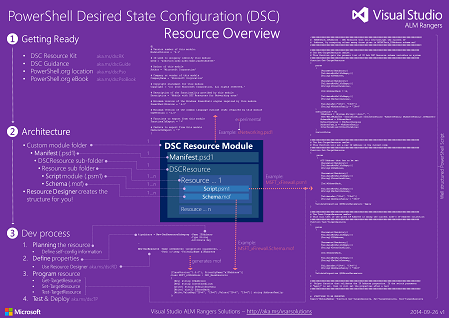
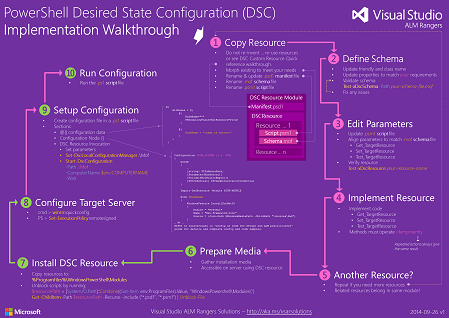
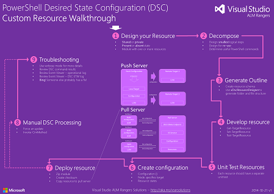
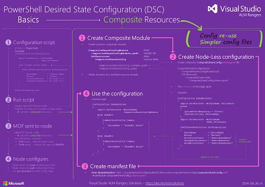

[VISUAL STUDIO ALM RANGERS](http://aka.ms/vsaraboutus)
 ---

# PowerShell Desired State Configuration (DSC) for DevOps and ALM practitioners 
Edition: 1.3.0 - 2015.07.11

## Foreword
We hear the term ‘DevOps’ frequently in current press, popular books, and presentations from many product vendors. The DevOps concept focuses on how to build deep integration between Development and Operations, organizations who have historically been at odds. This has been brought about, in part, by the need to increase the velocity of delivery from development into production, while ensuring that the Production environments are always running.

Many of the difficulties are well understood, and documented in those same DevOps articles, books, and presentations. One of the big problems to solve is ensuring that everyone is working with the same processes, systems, and tools, throughout the product development and delivery cycle.
 
The Development team needs to know that changes they deliver to Operations will work in Production, so they need to develop and test their changes in environments that match Production systems. The same automation scripts Operations use in Production should be used in the early test VMs and pre-Production test environments. Any changes to the system that were required by the Developers would be made in the automation scripts directly, and included with their updates. Those scripts then document the modified environment, improving the ability to review changes with the Operations team before they would be applied. 

The Operations team needs to know that you have proven that what they are deploying will work in Production, or they need to spend critical time re-validating changes during ‘outage windows.’ Automating system setup and configuration is not new, but historically the scripts were monolithic, requiring the Operations team to modify the core code when moving from test environments into Production. Separating the actions in the automation code from the environmental data (such as server names & accounts) simplifies the updates, and reduces the risk of error. In addition, by restricting changes to what is in automation scripts, updates can be validated in advance, rolled back if something bad occurs, and helps maintain the consistency of common systems. 

The development of PowerShell Desired State Configuration (DSC) was based in part on these attributes. PowerShell DSC is a set of extensions to the PowerShell language that enable creating PowerShell functions that are repeatable, and by design scripts, separated into components for repeatable actions, structural configuration, and environmental data. In PowerShell DSC, the separate components are called Resources, Configurations, and Configuration Data. This separation of action, structure, and data is a new way of scripting, and requires changes in thinking. PowerShell is new to most Developers, and the style of coding is new to experienced PowerShell users. 

With any system built using PowerShell DSC Configurations, the PowerShell DSC engine periodically tests the current state of the machine against the desired state, monitoring and alerting, and optionally automatically correcting configuration drift. Configuration changes that do not come via changes to the PowerShell DSC code are quickly identified and resolved. In addition, Visual Studio is integrating PowerShell DSC into the Development process and the release management pipeline – something that will be covered in future articles. Packages built using Visual Studio can now include the DSC resources and configurations needed to deploy the system.

The change to DevOps has broad impact, and we cannot cover it all in one place. This document focuses on getting users familiar with PowerShell DSC. For those unfamiliar with PowerShell, it gives some guidance on where and how to learn the capabilities of PowerShell, and leverage it in their coding projects. For those already familiar with PowerShell, it explains how DSC is Powershell with additional keywords and functionality, and how to leverage the tools and contributions from others to adopt rapidly these concepts when developing their own PowerShell DSC Resources and Configurations. It also directs users to sources of open-source repositories where they will find DSC Resources and examples that are available for their use, which will help speed the adoption of DSC. 
Integration of the code required for a smooth transition between Development and Operations is becoming a reality in many places. While PowerShell DSC helps to enable this, it does require some changes to the design and development of automation scripts. We hope this document will make the transition faster and easier.

*Keith Bankston – Senior Program Manager, WSSC WS PM USA*

## Intended Audience

We expect the majority of our audience personas to be Doris – Developer, whereby Dave – TFS Server Administrator, Jane – Infrastructure specialist and Bill – ALM Consultant can leverage the guidance. See [ALM Rangers Personas and Customer Types](http://vsarguidance.codeplex.com/releases/view/88001) for more information on these and other personas.

The guide assumes a good knowledge of the PowerShell, Windows, Visual Studio and Team Foundation Server (TFS) and an operational administration mindset – in other words, intermediate to advanced developers and possibly TFS Administrators, who are looking at the option of automating the configuration and deployments of their environments.

## Contributors
Brian Blackman, Brian Minisi, Donovan Brown, Giulio Vian, Hamid Shahid, Jahangeer, Jahangeer Mohammed, Jeff Levinson, Jim Szubryt, Keith Bankston, Larry Guger, Marcus Fernandez, Mathias Olausson, Mattias Skold, Michel Perfetti, Nicholas Hauenstein, Prasanna Ramkumar, Ricardo Serradas, Richard Fennell, Rob Jarratt, Rob Jarratt, Robert MacLean, Rui Melo, Shawn Cicoria, Suliman AlBattat, Taavi Koosaar, Tiago Pascoal, Vinicius Hana Scardazzi, William Salazar, Willy-Peter Schaub.

## Using the sample source code, Errata and support
All source code in this guide is available for download from [Config as Code for DevOps and ALM practitioners](https://vsardevops.codeplex.com/) CodePlex site and [Script resources for IT professionals](http://gallery.technet.microsoft.com/scriptcenter).

## Table of Contents

- [README (*this*)](./README.md)
- [Setting the context for PowerShell DSC](./Setting the context for PowerShell DSC.md)
- [Interesting Questions and Answers](./Interesting Questions and Answers.md)
- [Walkthrough - File Server & Share Custom Resource](./Building and sharing a custom resource walkthrough.md)
- [Walkthrough - Deploy TFS 2013 using DSC](./Deploy TFS 2013 using DSC.md)
- Appendix
	- [PowerShell 101](./Getting started with PowerShell.md)
	- [Scenario - Deploy a website using MSDeploy](./Scenario - Deploy a website using MSDeploy.md)
	- [Scenario - Deploying a database using DacPac using DacPac](./Scenario - Deploying a database using DacPac.md)
	- [Scenario - TFS 2013 on a single ATDT server](./Scenario - TFS 2013 on a single ATDT server.md)

## Quick Reference Posters

  
  