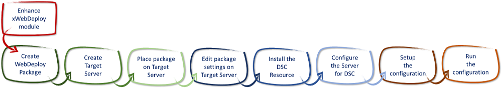
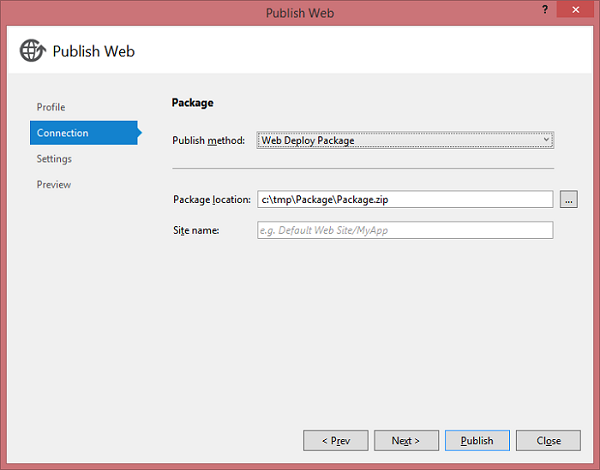
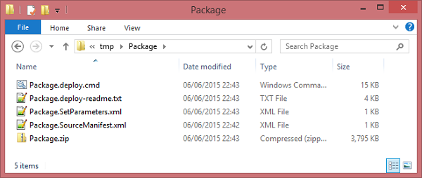

[VISUAL STUDIO ALM RANGERS](http://aka.ms/vsaraboutus)
---
| [README](./README.md) | [Setting the context for PowerShell DSC](./Setting the context for PowerShell DSC.md) | [Interesting Questions and Answers](./Interesting Questions and Answers.md) | [Walkthrough - File Server & Share Custom Resource](./Building and sharing a custom resource walkthrough.md) | [Walkthrough - Deploy TFS 2013 using DSC](./Deploy TFS 2013 using DSC.md) |

| Appendix [PowerShell 101](./Getting started with PowerShell.md) | [Scenario - **Deploy a website using MSDeploy**](Scenario - Deploy a website using MSDeploy.md) | [Scenario - Deploying a database using DacPac](./Scenario - Deploying a database using DacPac.md) | [Scenario - TFS 2013 on a single ATDT server](./Scenario - TFS 2013 on a single ATDT server.md) |

# Deploy a website using MSDeploy in a PowerShell DSC context

Show a practical scenario on how to deploy a website using a web deploy package when working within a PowerShell DSC context.

### Prerequisites

Each of these prerequisite steps are mapped to a DSC resource. 

1. The Internet Information Services (IIS) feature is enabled.
2. ASP.NET 4.5 is installed.
3. The default web site is stopped.
4. A new AppPool is created.
5. A new web site using the new AppPool is created.
6. Web Deploy package is installed.

### Walkthrough

1.  Review the [resources](#resources) used to support the scenario activities.
2.  [Enhance](#enhance-xwebdeploy) the [xWebDeploy](https://github.com/PowerShell/xWebDeploy) module.
3.  Install a website using the xWebDeploy Module



Figure – Walkthrough of deploying a website using MSDeploy in a PowerShell DSC context

### References

- [GitHub - xWebDeploy](https://github.com/PowerShell/xWebDeploy)
- [Gallery - xWebAdministration](https://gallery.technet.microsoft.com/scriptcenter/xWebAdministration-Module-3c8bb6be)
- [Using Release Management vNext templates when you don’t want to use DSC scripts ](Using%20Release%20Management%20vNext%20templates%20when%20you%20don’t%20want%20to%20use%20DSC%20scripts)
- [How to: Use Web Deploy Parameters in a Web Deployment Package](https://msdn.microsoft.com/en-us/library/ff398068(v=vs.110).aspx)

----------

### Resources

#### xWebAdministration Resources

The Resource Kit already has a resource for Web Administration, called [xWebAdministration](https://gallery.technet.microsoft.com/scriptcenter/xWebAdministration-Module-3c8bb6be). This was used without modification in this walkthrough to create and manage the IIS system.

#### xWebDeploy Resources

Like DSC, the Web Deploy command aims to provide idempotent operations i.e. it can be rerun repeatedly on a machine and always give the same result. This raises the question as to whether Web Deploy is a suitable candidate for a DSC resource, or if it is better run directly from a simple PowerShell script, as discussed in [Using Release Management vNext templates when you don’t want to use DSC scripts](http://blogs.blackmarble.co.uk/blogs/rfennell/post/2015/06/18/Using-Release-Management-vNext-templates-when-you-dont-want-to-use-DSC-scripts.aspx).

For the purposes of this walkthrough we are only considering the DSC option. GitHub already has a resource for Web Deploy, called [xWebDeploy](https://github.com/PowerShell/xWebDeploy)[4] module. However, it was found to have a deficiency, which this scenario walkthrough addressed.

The problems identified with the resource, version **1.0.0.0-PSGallery** for [xWebDeploy](https://github.com/PowerShell/xWebDeploy) module were as follows:

- The module only allowed you to provide a **Source** and **Destination** parameter to the underlying **MSDEPLOY.EXE** command.
- It was not possible to specify a **ParamFile**; so a user is unable to specify the XML file that can be used to update the web.config file. See [Use Web Deploy Parameters in a Web Deployment Package](https://msdn.microsoft.com/en-us/library/ff398068(v=vs.110).aspx)[5] for details.

#### Limitations

The Resources described here are not fully “make it so”. The testing of the current state of any installed packages is limited, and tends to trigger more re-deployments than it should. However, due to the idempotance of the MSDEPLOY web deployment tools themselves this is not seen as an issue.

### Enhance xWebDeploy

#### Adding the extra Parameter

The **1.0.0.0-PSGallery** for [xWebDeploy](https://github.com/PowerShell/xWebDeploy) module was modified to allow the **ParamFile** to be specified.

**\>\> NOTE \>\>** If you are using a later version of the [xWebDeploy](https://github.com/PowerShell/xWebDeploy) module, please verify that the enhancement has not been applied already.

However, by specifying the **ParamFile** we are over overriding the value of the **Destination** parameter. As the **Destination** parameter is mandatory for the resource, we need to pass in the default value of ‘**Auto**’, to match the value that is automatically generated as part of the command scripts in the Web Deploy package.

This changes the usage of the resource from …

```powershell
xWebPackageDeploy WebPackageDeploy
{ 
    SourcePath = "C:\\Package\\Package.zip"
    Destination = "MySite/MyApp"
    Ensure = "Present"
}
```

… to:

```powershell
xWebPackageDeploy WebPackageDeploy
{ 
    SourcePath = "C:\\Package\\Package.zip"
    Destination = "Auto"
    ParamFile = "C:\\Package\\Package.SetParameters.xml"
}
```

See these sample files for more information on the source code use by this scenario:
- [readme.txt](readme.txt)
- [Pandoc_Convert_Files.ps1](samples/Pandoc_Convert_Files.ps1)
- [xWebPackageDeploy.psm1](xWebPackageDeploy.psm1)

### Steps to Install a Website

#### Step 1 - Create the WebDeploy Package

For this walkthrough we use a simple ‘Hello World’ MVC application

1. Load Visual Studio
2. Create a new MVC Web Application
3. Select the new project in Solution Explorer and right click to select ‘Publish’

	

4. Select the ‘Web Deploy Package’ option and select a local folder to publish the deployment files too e.g. c:\\tmp\\Package\\Package.zip

5. Publish the files, you should see the following

	

#### Step 2 - Create the Target Server

- We will be deploying to an empty Windows 2012 Server, this can be hosted on Azure, a local VM or physical server.

- Provision the target server.

#### Step 3 - Place the Package on the Target Server

- Copy the package folder create in Step 1 to the test server from Step 2 e.g. copy the package to *c:\\Package* (or to a shared network accessible location)

#### Step 4. Edit the Package settings on the Target Server

- The copied folder will contain a file ***[Package].setparameters.xml***.
- This will contain the ‘**IIS Web Application Name**’ value and could contain any **web.config** settings you wish to edit during the deployment[6].
- Edit the ‘**IIS Web Application Name**’ entry to provide the name of the new web site (including a web application if required) e.g. **Web-Site/MyApp**

	```powershell
	<?xml version="1.0" encoding="utf-8"?\>
	<parameters\>
	    <setParameter name="IIS Web Application Name" value="Web-Site/MyApp" /\>
	    <setParameter name="DefaultConnection-Web.config Connection String" value="Data Source=(LocalDb)MSSQLLocalDB;AttachDbFilename=|DataDirectory|\\aspnet-MyWebsite-20150606104120.mdf;Initial Catalog=aspnet-MyWebsite-20150606104120;Integrated Security=True" /\>
	</parameters\>
	```

#### Step 5 - Install the DSC Resources

-   Copy the xWebAdministration and the xWebDeploy resources to the following directory on the target server:

	```powershell
	%ProgramFiles%\\WindowsPowerShell\\Module
	```

-   Make sure that the scripts are not blocked by running the following command:

	```powershell
	$resourcePath = [System.IO.Path]::Combine((Get-Item env:ProgramFiles).Value, "WindowsPowershell\\Modules\\")
	
	Get-ChildItem -Path $resourcePath -Recurse -include ("\*.psd1", "\*.psm1") | Unblock-File
	```

#### Step 6 - Configure the Server for DSC

To be able to run DSC and the PowerShell scripts, on the server, carry out the following steps:

1. Run the **winrm** command from a **command prompt** (do not use a PowerShell shell as this may hang):

	```console
	winrm quickconfig
	```

2. Enable execution of unsigned scripts using the following PowerShell command, from a shell that is running with elevated permissions:

	```console
	Set-ExecutionPolicy remotesigned
	```

3. If the server is part of a domain and domain accounts are going to be used then enable CredSSP using the following command:

	```console
	winrm set winrm/config/client/auth @{CredSSP="true"}
	```

#### Step 7 - Set up the Configuration

- Place the following PowerShell configuration into a .ps1 file on the server:

	```powershell
	Configuration DeployWeb
	{
		Import-DscResource -ModuleName xWebAdministration
		import-DscResource -ModuleName xWebDeploy
	
		Node $NodeName
		{
			# Install IIS
			WindowsFeature IIS
			{
			    Ensure = "Present"
			    Name = "Web-Server"
			}
		
			# Install .Net 4.5
			WindowsFeature AspNet45
			{
			    Ensure = "Present"
			    Name = "Web-Asp-Net45"
			}
			
			# Stop the default website
			# Created when IIS enabled
			xWebsite DefaultSite
			{
			    Ensure = "Present"
			    Name = "Default Web Site"
			    State = "Stopped"
			    PhysicalPath = "C:\\inetpub\\wwwroot"
			    DependsOn = "[WindowsFeature]IIS"
			}
		
			# Create a new AppPool with name of package
			xWebAppPool WebAppPool
			{
			    Ensure = "Present"
			    Name = "$SiteName"
			    DependsOn = "[WindowsFeature]IIS"
			}
			
			# Copy the default web site content to create a
			# physical folder for the web site
			File WebContent
			{
			    Ensure = "Present"
			    SourcePath = "C:\\inetpub\\wwwroot"
			    DestinationPath = "C:\\inetpub\\$PackageName"
			    Recurse = $true
			    Type = "Directory"
			    DependsOn = "[xWebAppPool]WebAppPool"
			}
			
		    # Create the new web site
			xWebsite NewWebsite
			{
			    Ensure = "Present"
			    Name = "$SiteName"
			    State = "Started"
			    PhysicalPath = "C:\\inetpub\\$PackageName"
			    ApplicationPool = "SiteName"
			    BindingInfo = MSFT\_xWebBindingInformation
			    {
			        Protocol = "HTTP"
			        Port = 80
			    }
			    DependsOn = "[File]WebContent"
			}
			
			# Deploy the package
			xWebPackageDeploy WebPackageDeploy
			{
			    DependsOn = "[xWebsite]NewWebsite"
			    SourcePath = "$PackageFolder\\$PackageName.zip"
			    Destination = "Auto"
			    ParamFile = "$PackageFolder\\$PackageName.SetParameters.xml"
			    Ensure = "Present"
			}
		}
	}
	```

- At the top of the file just created above, add the configuration data, which must be set up along the following lines, replacing the marked tokens:

	```powershell
	$configData = @{
		AllNodes = @(
						@{
							NodeName = "[servername]”
							PackageFolder = “[local package folder]”
							PackageName = “[name of package]”
							SiteName = "[Web site/app name to create]"
						}
					 )
					}
	```

	**\>\> NOTE \>\>** The **SiteName** must match the entry made in Step 3 for the ‘**IIS Web Application Name**’

- At the end of the file just created above, add the following script which actually invokes the DSC resources. Replace the marked tokens at the start of the script:

	```console
	DeployWeb -ConfigurationData $ConfigData
	Start-DscConfiguration -Wait -force -Verbose -Path .\\Deployweb
	```

Step 8 - Run the Configuration
------------------------------

- Run the script that was created in the previous step.
- This should update Windows, install IIS and deploy the web site. Check the log file location if you want to check on progress.

