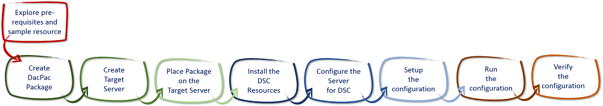
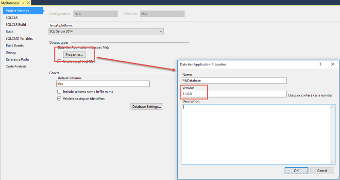
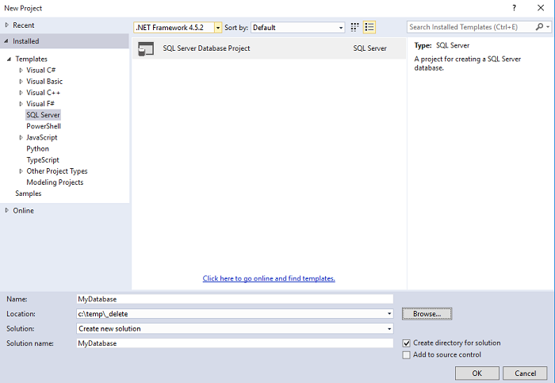
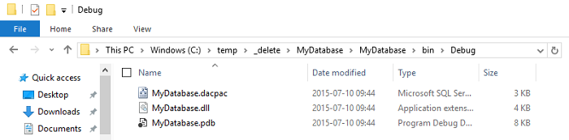

[VISUAL STUDIO ALM RANGERS](http://aka.ms/vsaraboutus)
---
| [README](./README.md) | [Setting the context for PowerShell DSC](./Setting the context for PowerShell DSC.md) | [Interesting Questions and Answers](./Interesting Questions and Answers.md) | [Walkthrough - File Server & Share Custom Resource](./Building and sharing a custom resource walkthrough.md) | [Walkthrough - Deploy TFS 2013 using DSC](./Deploy TFS 2013 using DSC.md) |

| Appendix [PowerShell 101](./Getting started with PowerShell.md) | [Scenario - Deploy a website using MSDeploy](Scenario - Deploy a website using MSDeploy.md) | [Scenario - **Deploying a database using DacPac**](./Scenario - Deploying a database using DacPac.md) | [Scenario - TFS 2013 on a single ATDT server](./Scenario - TFS 2013 on a single ATDT server.md) |

# Deploying a database

In this scenario, we will look at the process of deploying a database to SQL Server using a DacPac package. We will use a custom DSC resource, cDacPac, which installs a DacPac package and register it into the configuration table in SQL Server

### Prerequisites

- This scenario is based on the DacPac Sample resource.
- This module requires:
	- SQL Server 2012 or later.
	- The latest version of PowerShell (v4.0, which ships in Windows 8.1 or Windows Server 2012R2). To easily use PowerShell 4.0 on older operating systems, install WMF 4.0. Please read the installation instructions that are present on both the download page and the release notes for WMF 4.0. 
- All of the sample resources are provided AS IS, and are not supported through any Microsoft standard support program or service. The “c” in cDacPac stands for community, which means that these resources may be fix forward and monitored by the community. If you would like to modify the community modules, feel free. When modifying, please update the module name, resource friendly name, and MOF class name (instructions below).
- The resource described here is not fully “make it so”. The testing of the current state of any installed packages is limited, and tends to trigger more re-deployments than it should. The resource checks the DacPac registration data in SQL Server to determine if the DacPac needs to be installed.

### Walkthrough

1. Verify prerequisites and explore sample resource
2. Create the DacPac Package
3. Create the Target Server
4. Place the Package on the Target Server
5. Install the DSC Resources
6. Configure the Server for DSC
7. Set up the Configuration
8. Run the Configuration
9. Verify the Configuration



Figure – Walkthrough deploying a database

### 1. Explore [cDacPac](./samples/cDacPac) Resource

To deploy a DacPac package the cDacPac resource uses the SQL Server DAC Fx framework. The [cDacPac](./samples/cDacPac) resource is based on the work from the xDatabase package , the features in the original package has primarily been extended to better support the use of a DacPac version to determine if the package should be deployed or not. The cDacPac resource will deploy the package if the database does not exist and the DacPac version does not match the registered version. 
You set the package version in the database project settings:



These values are stored in the project file so make sure to update the version during build (just like any other application version) if you are using a build system. If your package does not contain the version number you want to register you can optionally provide the version number to the DSC configuration.

The table below lists the arguments for the resource.

|Argument|Type|Required|Description|
|--------|----|--------|-----------|
|SqlServer|String|Yes|The SQL server|
|DatabaseName|String|Yes|The name of the database to be deployed|
|DacPacPath|String|Yes|The path to the .dacpac file to be used for database schema deploy|
|SqlServerVersion|String|Yes|The version of the SQL Server. This property can take the following values: { 2008-R2 , 2012 , 2014 }|
|DacPacVersion|String|No|The version of the DacPac package. If omitted the version from the DacPac package is used.|
|SqlConnectionCredential|PSCredential|No|The credential to connect to the SQL server|
|Ensure|String|Yes|The DSC action to perform. This property can take the following values: { Absent , Present }|

### 2. Create the DacPac Package

For this walkthrough, we use a simple ‘Hello World’ Database project

1.	Load Visual Studio.
2.	Create a new SQL Server Database Project.

	

3.	Build the project.
4.	Open the build output folder, you should see the following (including the DacPac package):

	

### 3. Create the Target Server

- In this walkthrough we will be deploying to a Windows 2012 Server.
- This can be hosted on Azure, a local VM or physical server so you will need to install/create this server. 
- We also to make sure SQL Server 2012 or later is installed.

### 4. Place the Package on the Target Server

- Copy the package folder create in Step 1 to the test server from Step 2.
- For example, copy the package to c:\Package (or to a shared network accessible location)

### 5. Install the DSC Resources

- Copy the cDacPac resource to the following directory on the target server:

	```console
	%ProgramFiles%\WindowsPowerShell\Module 
	```
- Make sure that the scripts are not blocked by running the following command:

	```powershell
	$resourcePath = [System.IO.Path]::Combine((Get-Item env:ProgramFiles).Value, "WindowsPowershell\Modules\")
	Get-ChildItem -Path $resourcePath -Recurse -include ("*.psd1", "*.psm1") | Unblock-File 
	```

### 6. Configure the Server for DSC

To be able to run DSC and the PowerShell scripts, on the server, carry out the following steps:

1.	Run the following command from a command prompt (do not use a PowerShell shell as this may hang):

	```powershell
	winrm quickconfig
	```

2.	Enable execution of unsigned scripts using the following PowerShell command, from a shell that is running with elevated permissions:

	```powershell
	Set-ExecutionPolicy remotesigned 
	```

3.	If the server is part of a domain and domain accounts are going to be used then enable CredSSP using the following command:

	```powershell
	winrm set winrm/config/client/auth @{CredSSP="true"}
	```

### 7. Set up the Configuration

- Place the following PowerShell configuration into a .ps1 file on the server:

	```powershell
	Configuration InstallDacPac
	{
	    Import-DscResource -ModuleName cDacPac
	
	    node $AllNodes.NodeName
	    {
	        cDacPac DeployDacPac
	        {
	            SqlServer = $Node.SqlServer
	            DatabaseName = $Node.DatabaseName
	            DacPacPath = $Node.DacPacPath
	            SqlServerVersion = '2014'
	            Ensure = 'Present'
	        }
	    }
	} 
	```

- At the top of the file just created above, add the configuration data, which must be set up along the following lines, replacing the marked tokens:

	```powershell
	$ConfigData = @{
	    AllNodes = @(
	        @{
	            NodeName = "[servername]” 
	            SqlServer = "[sqlserver name]” 
	            DatabaseName = “[database name]”
	            DacPacPath = “[path to dacpac package]”
	        }
	    )
	}
	```

- At the end of the file just created above, add the following script which actually invokes the DSC resources. Replace the marked tokens at the start of the script:

	```powershell
	InstallDacPac -ConfigurationData $ConfigData  
	Start-DscConfiguration -Path .\InstallDacPac -Wait -Force -Verbose
	```

### 8. Run the Configuration

- Run the script created in the previous step. 
- This should deploy the database to SQL Server. 
- Check the log file location if you want to check on progress.

### 9. Verify the Configuration

- Open SQL Server Management Studio and verify that the database has been created. 
- Run the following script to verify that the DacPac has been registered correctly:

	```sql
	SELECT * FROM [msdb].[dbo].[sysdac_instances]
	```
