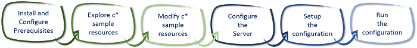

[VISUAL STUDIO ALM RANGERS](http://aka.ms/vsaraboutus)
---
| [README](./README.md) | [Setting the context for PowerShell DSC](./Setting the context for PowerShell DSC.md) | [Interesting Questions and Answers](./Interesting Questions and Answers.md) | [Walkthrough - File Server & Share Custom Resource](./Building and sharing a custom resource walkthrough.md) | [Walkthrough - Deploy TFS 2013 using DSC](./Deploy TFS 2013 using DSC.md) |

| Appendix [PowerShell 101](./Getting started with PowerShell.md) | [Scenario - Deploy a website using MSDeploy](Scenario - Deploy a website using MSDeploy.md) | [Scenario - Deploying a database using DacPac](./Scenario - Deploying a database using DacPac.md) | [Scenario - **TFS 2013 on a single ATDT server**](./Scenario - TFS 2013 on a single ATDT server.md) |

# Install and configure TFS 2013 on a single ATDT server

Show a practical scenario on how to deploy a Team Foundation Server 2013 and SQL Server om a single ATDT server. A typical usage scenario would be to create consistent **demo** or **test** servers.

### Prerequisites

- This scenario is based on the [Walkthrough Deploy TFS 2013 using DSC](./Deploy TFS 2013 using DSC.md) and the associated **cSQL** and **cTFS** community [sample](./samples/Walkthrough Deploy TFS 2013 using DSC/Modules) resources.
- This module requires the latest version of PowerShell (v4.0, which ships in Windows 8.1 or Windows Server 2012R2). To easily use PowerShell 4.0 on older operating systems, install WMF 4.0. Please read the installation instructions that are present on both the download page and the release notes for WMF 4.0. 
- All of the sample resources are provided AS IS, and are not supported through any Microsoft standard support program or service. The “c” in cSql stands for community, which means that these resources may be fix forward and monitored by the community. If you would like to modify the community modules, feel free. When modifying, please update the module name, resource friendly name, and MOF class name (instructions below).

### Walkthrough

1. Install and configure prerequisites.
2. Explore c* sample resources.
3. Modify c* sample resources.
4. Configure the server
5. Setup the configuration
6. Run the configuration



Figure – Walkthrough deploying TFS 2013 on a single ATDT server

### 2. Explore Resources

#### [cSql](./samples/Walkthrough - Deploy TFS 2013 using DSC/Modules/cSql) Module
The **cSql** module contains the **cSqlReportingServices**, **cSqlServerAnalysisService** **cSqlServerEngine**, **cSqlServerManagementStudio** resources. These DSC Resources allow you to easily configure and maintain your file SQL Server by writing simple configurations.

- **cSqlServerEngine** resource has following properties:
	- InstanceName: The desired Instance name 
	- AgentServiceAccount: Account Running SQL Agent
	- AgentServiceStartupType: Automatic, Disabled or Manual 
	- FullText: Present or Absent
	- InstanceDirectory: Desired location for the instance
	- LogPath: Directory where logs will be stored. 
	- SourcePath: Source of the SQL installation media
	- SourcePathCredential: If required Credentials to access source media
	- SqlServiceAccount: Service Account running SQL 
	- SysAdminAccount: SQL Administrator account 
	- TempDBDataDirectory: Temp Database Directory 
	- TempDBLogDirectory: Temp Database Log Directory 
	- UserDBDataDirectory: User Database Directory 
	- UserDBLogDirectory: User Log Directory 
- **cSqlReportingServices** resource has following properties:
	- InstanceName: The desired Instance Name 
	- ServiceAccountName: Service Account running SQL Reporting Service 
	- InstanceDirectory: Desired location for the instance
	- LogPath: Log Path location 
	- Mode: Native or SharePoint 
	- SourcePath: Source of the SQL installation media
	- SourcePathCredential: If required Credentials to access source media
	- SqlServerInstance: Instance of SQL server to interact with
- **cSqlServerAnalysisServices** resource has the following properties 
	- InstanceName: The desired instance name 
	- InstanceDirectory: Desired location for the instance
	- LogPath: Desired location for the logs
	- ServiceAccount:  Desired service account 
	- SourcePath: Source of the SQL installation media
	- SourcePathCredential: If required Credentials to access source media
	- SysAdminAccount: Desired System Administration account
	- TempDataDirectory: Temporary data directory 


#### [cTfs](./samples/Walkthrough - Deploy TFS 2013 using DSC/Modules/cTfs) Module
The **cTfs** module contains the **cTfsApplicationTier** and **cTfsBuildServer** resources. These DSC Resources allow you to easily configure and maintain your TFS environment by writing simple configurations.

- **cTfsApplicationTier** resource has following properties:
	- Name: Desired name 
	- FileCacheDirectory: Desired file cache locaation
	- LogPath: Desired Log path location
	- SourcePath: Source of the SQL installation media
	- SourcePathCredential: If required Credentials to access source media
	- SqlServerInstance: Desired SQL Server Instance 
	- TeamProjectCollectionName: Initial collection name
	- TfsAdminCredential: Desired  administrator account
	- TfsServiceAccount: Desired Service Account
- **cTfsApplicationTier** resource has following properties:
	- Name: Desired Name 
	- AgentCount: Desired Agents 
	- BuildServiceCredential: Desired Service Credentials 
	- ConfigurationCredential: Desired Configuration Credentials 
	- LogPath: Desired Log Path location 
	- Port: Desired port
	- SourcePath: Source of the SQL installation media
	- SourcePathCredential: If required Credentials to access source media
	- TeamProjectCollectionUri: Desired Team Project Uniform Resource Identifier

#### [cWebAdministration](./samples/Walkthrough - Deploy TFS 2013 using DSC/Modules/cWebAdministration) Module
The cWebAdministration module contains the cWebAppPool resources. These DSC Resources allow you to easily configure and maintain your Web App Pools by writing simple configurations.

- **cWebAppPool** resource has following properties:
	- Name: Desired name 
	- State: Started or Stopped

### 3. Modify Resources
When making changes to these resources, we suggest the following practice:

1. Update the following names by replacing **VSAR** with your company/community name or another prefix of your choice: 
	- **Module Name** (ex: cSql remains as cSql) 
	- **Resource Folder** (ex: VSAR_cSqlReportingServices becomes **Contoso_**cSqlReportingServices) 
	- **Resource Folder** (ex: VSAR_cSqlServerEngine becomes **Contoso_**cSqlServerEngine) 
	- **MOF class name** (ex: : VSAR_cSqlServerEngine becomes **Contoso_**cSqlServerEngine) 
	- **Filename** for the <resource>.schema.mof (ex: VSAR_cSqlServerEngine.schema.mof becomes **Contoso_**cSqlServerEngine.schema.mof) 
2. Update module and metadata information in the module manifest 
3. Update any configuration that use these resources 

We reserve resource and module names without prefixes ("**x**" or "**c**") for future use (e.g. "VSAR_ cSqlServerEngine " or "SqlServerEngine"). If the next version of Windows Server ships with a "SqlServerEngine" resource, we don't want to break any configurations that use any community modifications. Please keep a prefix such as "c" on all community modifications.

### 4. Configure the Server for DSC

To be able to run DSC and the PowerShell scripts, on the server, carry out the following steps:

1. Run the **winrm** command from a **command prompt** (do not use a PowerShell shell as this may hang):

	```console
	winrm quickconfig
	```

2. Enable execution of unsigned scripts using the following PowerShell command, from a shell that is running with elevated permissions:

	```console
	Set-ExecutionPolicy remotesigned
	```

3. If the server is part of a domain and domain accounts are going to be used then enable CredSSP using the following command:

	```console
	winrm set winrm/config/client/auth @{CredSSP="true"}
	```

### 5. Setup the configuration

- This configuration will setup a basic TFS environment.

	```powershell
	$ConfigData=
	@{
	    AllNodes = @(
	        @{
	            NodeName="*"
	            PSDscAllowPlainTextPassword=$true
	         }
	
	       @{
	            NodeName = "<name of TFS server>" 
	
	        }
	    )
	 }
	
	Configuration Tfs
	{
	    param
	    (
	        [Parameter(Mandatory)]
	        [string] $WindowsMediaPath,
	        [Parameter(Mandatory)]
	        [string] $SqlServerMediaPath,
	        [Parameter(Mandatory)]
	        [string] $TfsMediaPath,
	        [Parameter(Mandatory)]
	        [string] $LogPath,
	        [Parameter(Mandatory=$true)] 
	        [ValidateNotNullorEmpty()] 
	        [PSCredential] $TfsAdministratorCredential
	    )
	
	    Import-DscResource -Module cSql
	    Import-DscResource -Module cTfs
	
	    Node <name of TFS server>
	    {
	        WindowsFeature InstallDotNet35
	        {            
	            Ensure = "Present"
	            Name = "Net-Framework-Core"
	            Source = (Join-Path $WindowsMediaPath -ChildPath "\Sources\SxS")
	        }
	    
	        WindowsFeature InstallDotNet40
	        {            
	            Ensure = "Present"
	            Name = "AS-NET-Framework"
	        }
	    
	        cSqlServerEngine InstallSqlServer2012Engine
	        {
	            InstanceName = "MSSQLSERVER"
	            Ensure = "Present"
	            AgentServiceAccount = "NT Authority\Network Service"
	            SqlServiceAccount =  "NT Authority\Network Service"
	            SysAdminAccount = $TfsAdministratorCredential.UserName
	            TempDBDataDirectory = "C:\SQL\Databases\TempDB\"
	            TempDBLogDirectory = "C:\SQL\Databases\TempDB\"
	            UserDBDataDirectory = "C:\SQL\Databases\UserDBs\"
	            UserDBLogDirectory = "C:\SQL\Databases\UserDBs\"
	            FullText = "Present"
	            LogPath = $LogPath
	            SourcePath = $SqlServerMediaPath
	            DependsOn = "[WindowsFeature]InstallDotNet35","[WindowsFeature]InstallDotNet40"
	        }
	    
	        cSqlServerAnalysisServices InstallSqlServer2012AnalysisServices
	        {
	            InstanceName = "MSSQLSERVER"
	            Ensure = "Present"
	            ServiceAccount = "NT Authority\Network Service"
	            SysAdminAccount = $TfsAdministratorCredential.UserName
	            TempDataDirectory = "C:\SQL\AnalysisServices\Temp\"
	            LogPath = $LogPath
	            SourcePath = $SqlServerMediaPath
	            DependsOn = "[WindowsFeature]InstallDotNet35","[WindowsFeature]InstallDotNet40"
	        }
	    
	        cSqlServerManagementStudio InstallSqlServer2012ManagementStudio
	        {
	            Name = "SSMS"
	            Ensure = "Present"
	            InstanceDirectory = ""
	            Advanced = "Present"
	            LogPath = $LogPath
	            SourcePath = $SqlServerMediaPath
	            DependsOn = "[cSqlServerEngine]InstallSqlServer2012Engine", "[cSqlServerAnalysisServices]InstallSqlServer2012AnalysisServices"
	        }
	    
	        cTfsApplicationTier InstallTfs2013
	        {
	            Name = $Node.NodeName
	            Ensure = "Present"
	            TfsAdminCredential = $TfsAdministratorCredential
	            TfsServiceAccount = "NT AUTHORITY\Local Service"
	            SqlServerInstance = $Node.NodeName
	            FileCacheDirectory = "C:\TFS\FileCache"
	            TeamProjectCollectionName = "DefaultCollection"
	            LogPath = $LogPath
	            SourcePath = $TfsMediaPath
	            DependsOn = "[cSqlServerEngine]InstallSqlServer2012Engine", "[cSqlServerAnalysisServices]InstallSqlServer2012AnalysisServices"
	        }
	    
	        cTfsBuildServer InstallTfs2013BuildServer
	        {
	            Name = $Node.NodeName
	            Ensure = "Present"
	            ConfigurationCredential = $TfsAdministratorCredential
	            BuildServiceCredential = $TfsAdministratorCredential
	            Port = 9191
	            AgentCount = 2
	            TeamProjectCollectionUri = "http://localhost:8080/tfs/DefaultCollection/"
	            LogPath = $LogPath
	            SourcePath = $TfsMediaPath
	            DependsOn = "[cTfsApplicationTier]InstallTfs2013"
	        }
	    
	        LocalConfigurationManager 
	        { 
	            RebootNodeIfNeeded = $true
	        } 
	    }
	}
	
	$MofPath = ".\Mof" 
	$LogPath = "c:\DSCLogsTFS" 
	$WindowsMediaPath = "D:\"
	$SqlServerMediaPath = "E:\"
	$TfsMediaPath = "F:\"
	$domainName = "<domain/workgroup>"
	$domainAdminAccount = New-Object System.Management.Automation.PSCredential("$domainName\Administrator", (ConvertTo-SecureString "<password>" -AsPlainText -Force))
	
	if (!(Test-Path $MofPath))
	{
	    New-Item $MofPath -ItemType Directory
	}
	
	if (!(Test-Path $LogPath))
	{
	    New-Item $LogPath -ItemType Directory
	}
	
	Tfs -ConfigurationData $ConfigData -OutputPath .\Mof -WindowsMediaPath $WindowsMediaPath -SqlServerMediaPath $SqlServerMediaPath -TfsMediaPath $TfsMediaPath -LogPath $LogPath -TfsAdministratorCredential $domainAdminAccount
	
	Set-DscLocalConfigurationManager .\Mof
	
	Start-DscConfiguration -Path .\Mof -ComputerName $env:COMPUTERNAME -Wait force -Verbose -Path .\\DeployTFS
	```

### 6. Run the configuration
- Run the script that was created in the previous step.
- This should install SQL Server and Team FOundation Server. Check the log file location if you want to check on progress.

	**>> NOTE >>** This scenario has been captured in the [Scenario - TFS 2013 on a single ATDT server.wmv](https://vsardevops.codeplex.com/downloads/get/1465852) video.

### References

- [Demo Video](https://vsardevops.codeplex.com/downloads/get/1465852)
- [Walkthrough - Deploy TFS 2013 using DSC](./Deploy TFS 2013 using DSC.md)
