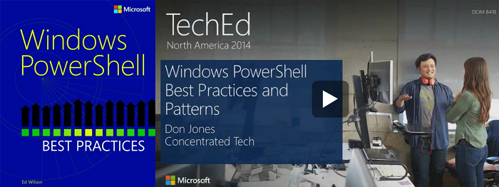
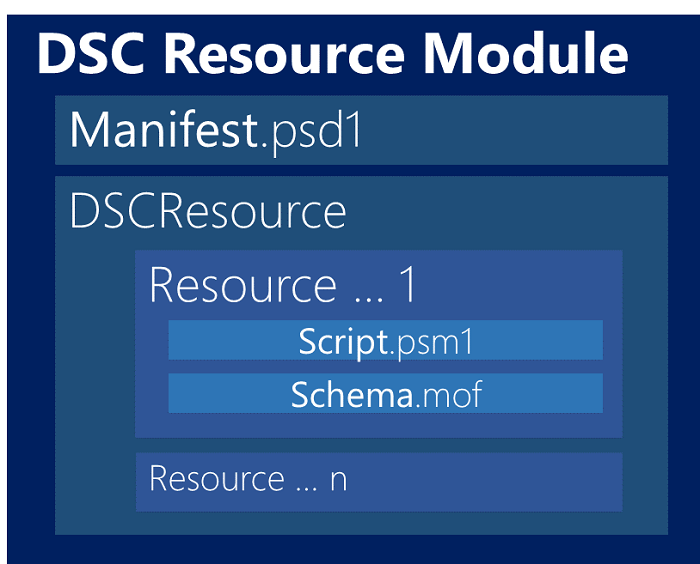
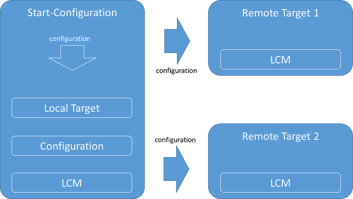
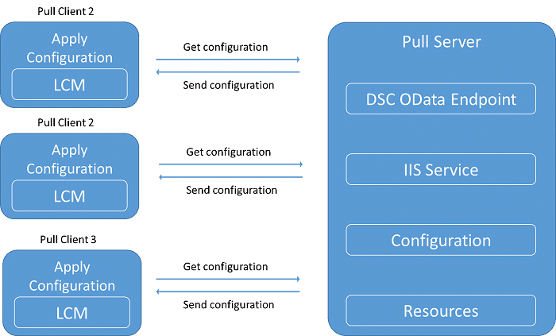
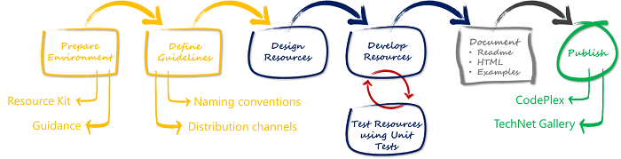

[VISUAL STUDIO ALM RANGERS](http://aka.ms/vsaraboutus)
 ---

| [README](./README.md) | [**Setting the context for PowerShell DSC**](./Setting the context for PowerShell DSC.md) | [Interesting Questions and Answers](./Interesting Questions and Answers.md) | [Walkthrough - File Server & Share Custom Resource](./Building and sharing a custom resource walkthrough.md) | [Walkthrough - Deploy TFS 2013 using DSC](./Deploy TFS 2013 using DSC.md) |

| Appendix [PowerShell 101](./Getting started with PowerShell.md) | [Scenario - Deploy a website using MSDeploy](Scenario - Deploy a website using MSDeploy.md) | [Scenario - TFS 2013 on a single ATDT server](./TFS 2013 on a single ATDT server.md) | [Scenario - Deploying a database using DacPac](./Scenario - Deploying a database using DacPac.md) |

# Setting the context for PowerShell DSC
In this section, we will explore some of the recommended best practices when writing DSC resources using PowerShell and the base template used by the Visual Studio ALM Rangers and provide a simple checklist we use to validate that we have met our minimum quality bar for our resources.

**>> NOTE >>** For a more comprehensive list and coverage, we strongly recommend the book [Windows PowerShell Best Practices](http://www.amazon.com/Windows-PowerShell-Best-Practices-Wilson/dp/0735666490/ref=tmm_pap_title_0?ie=UTF8&qid=1393958424&sr=1-1), by [Ed Wilson](http://www.amazon.com/s/ref=ntt_athr_dp_sr_1?_encoding=UTF8&field-author=Ed%20Wilson&ie=UTF8&search-alias=books&sort=relevancerank) and the [Windows PowerShell Best Practices and Patterns: Time to Get Serious](http://channel9.msdn.com/Events/TechEd/NorthAmerica/2014/DCIM-B418#fbid=), by [Don Jones](http://channel9.msdn.com/Events/Speakers/Don-Jones).


         
*Figure 1 - Windows PowerShell TechEd 2014 North America event*
 ---

## Overview
### What is DSC 
DSC is short for Desired state Configuration, and is a new way to manage deployments, that is fundamental different from traditional, instruction-based deployment. Instead of providing instructions for how to deploy your environment, you simply describe the Desired State you want to achieve in a PowerShell script file. You can then deploy or rather apply a Desired State Configuration to a server using the PowerShell engine.

*Desired State Configuration is Microsoft's technology, introduced in Windows Management Framework 4.0, for declarative configuration of systems. At the risk of oversimplifying a bit, DSC lets you create specially formatted text files that describe how you should configure your system. You then deploy those files to the actual systems, and they
magically configure themselves as directed. At the top level, DSC isn't programming it's just listing how you want a system to look.*

The DSC script format is declarative and consists simply of a list of **resources** and their desired properties. A resource can be a couple of PowerShell scripts to support DSC for a configuration object Microsoft provides DSC (both out of the box and for installation) resources.

**>> NOTE >>** Please refer to **Posters**, for information on a visual cheat sheet poster that guides you through the artefacts and samples (DSC **Overview**).

A PowerShell DSC **module** contains a **manifest**, one or more **resources**, each with a **script** and **schema**. We will explore the granularity of resources and the design of DSC modules as part of the guidance and walkthrough contained herein.



*Figure 2 - DCS module with resource artefacts*

The following configuration example uses resources provided out of the box to manage Window features, roles, and servers.

```powershell
Configuration ContosoWeb
{
    # A Configuration block can have zero or more Node blocks
    Node "Server001"
    {
        # Next, specify one or more resource blocks
        # WindowsFeature is one of the built-in resources you can use in a Node block
        # This example ensures the Web Server (IIS) role is installed
        WindowsFeature IIS
        {
            Ensure = "Present" # To uninstall the role, set Ensure to "Absent"
            Name = "Web-Server"
        }
        WindowsFeature ASP
        {
            Ensure = "Present" # To uninstall the role, set Ensure to "Absent"
            Name = "Web-Asp-Net45"
        }
        # File is a built-in resource you can use to manage files and directories
        # This example ensures files from the source directory are present in the destination directory
        File SiteCatalog
        {
            Ensure = "Present"  # You can also set Ensure to "Absent"
            Type = "Directory" # Default is "File"
            Recurse = $true
            SourcePath = $WebsiteFilePath # This is a path that has web files
            DestinationPath = "C:\inetpub\wwwroot"
            # The path where we want to ensure the web files are present
            DependsOn = "[WindowsFeature]ASP"
            # This ensures that MyRoleExample completes successfully before this block runs
        }
    }
}
```

This very simple script, uses the [WindowsFeature](http://technet.microsoft.com/en-us/library/dn282127.aspx) (a friendly name for the Role resource) to define the features that
need to be present in the *Server001* node.

In this case, it ensures we install the Web Server Role (with ASP.NET 4.5 features).

We specify that feature should be present in the configuration by specifying the **Present** value in the Ensure property. (We can also specify **Absent**, in that case when we run the configuration we will be sure the role will not be part of the machine configuration).

If you want to get the list of available features, you can run the PowerShell command
[Get-WindowsFeature](http://technet.microsoft.com/en-us/library/jj205469.aspx).

We also use the [File](http://technet.microsoft.com/en-us/library/dn282129.aspx) resource to copy the folder content (specified in the **WebsiteFilePath** variable) to the *C:\\inetpub\\wwwroot* (IIS default root).

With such a simple configuration script, we ensure we have a basic web role machine with a running website.

### Using PowerShell DSC for defining deployment in your project
PowerShell DSC is very useful for deployments and continuous deployment, as the state of the servers to which you are deploying becomes easier to handle. Your DSC deployment scripts will only focus on the desired state you want to accomplish. Furthermore, DSC can be faster, as it only affects those things that you need to adjust
to meet your requirements.

#### Separate data from configuration
PowerShell DSC can also separate your configuration data from the configuration logic, which is very useful in situations where you deploy to different environments in a release pipeline. For, example, when you have a bunch of machines, which perform the same functions, it is easy to add a machine with little effort and the exact same configuration
using DSC.

It is also highly beneficial when you have a number of machines performing the same function (for example a load-balanced web farm). This allows you to add equally configured machines on demand that perform the same rule to resolve any differences in the
configuration.

You can do this by parameterizing the configuration.
```powershell
Configuration ContosoWeb
{
    param ($AppTier, $DataTier)

    # A Configuration block can have zero or more Node blocks
    Node $AppTier
    {
        WindowsFeature IIS
        {
            Ensure = "Present" # To uninstall the role, set Ensure to "Absent"
            Name = "Web-Server"
        }
        WindowsFeature ASP
        {
            Ensure = "Present" # To uninstall the role, set Ensure to "Absent"
            Name = "Web-Asp-Net45"
        }
        File SiteCatalog
        {
            Ensure = "Present"  # You can also set Ensure to "Absent"
            Type = "Directory"  # Default is "File"
            Recurse = $true
            SourcePath = $WebsiteFilePath
            DestinationPath = "C:\inetpub\wwwroot"
            DependsOn = "[WindowsFeature]ASP"
        }
    }
    Node $DataTier
    { }
}
```    

Notice that after the Configuration keyword, we no longer have the **Server001** node name, but we now have the **AppTier** variable that you will pass when you run the configuration. You can also specify the configuration data by using the **Node** function.

#### Using PowerShell DSC: Push and Pull Modes
PowerShell DSC can be set up to run in Push and Pull modes. The difference is that in Push mode, DSC actively pushes the configuration to the target servers. See [Push and Pull Configuration Modes](http://blogs.msdn.com/b/powershell/archive/2013/11/26/push-and-pull-configuration-modes.aspx) for more information on push and pull servers.

The Push model is the simplest one and gives you control over the events and configurations, since they start manually.



*Figure 3 - Push Model*

In the Pull model, the target servers automatically pull the current configuration from a DSC Pull Server. The Pull model requires software installation and configuration, but provides scalability and conformability. The pull server allows a single repository of configurations. You can apply these to any number of target servers delivering a given role, hence giving scalability. We recheck a target server's state against this pull server on a regular schedule to avoid configuration drift if you manually update a target server's state.



*Figure 4 - Pull Model*

#### Developing PowerShell DSC resources
Apart from using Microsoft and community resources, you might sometimes need to create your own PowerShell DSC resource for a subsystem or third party solution. A DSC resource is usually just a PowerShell script module implementing the DSC interface.

To make a DSC resource you need to plan and define the resource, as well as implement three PowerShell functions

-   **Get-TargetResource** - This method should receive the keys of the resource and return a hash table with all the resource properties as configured on the system.

-   **Test-TargetResource** - This method receives the keys and properties (as defined in the schema) and checks if the current configuration for the resource exists in the system. If any of the property values do not match the resource instance, $false should be returned and $true otherwise.

-   **Set-TargetResource** - This method will be called to guarantee the resource instance matches the property values. This method must be idempotent so that after DSC runs the method, DSC must ensure the resource instance is exactly as defined. It needs to be able to create a resource from scratch or to make some changes to an existing resource to make sure its state matches the state defined in the configuration.

You also have to define your resource schema (MOF format), which defines the properties the resource will receive in the configuration.

When you have your script module (with the three functions) and the schema defined you will need to create your module manifest (your module can implement more than one resource).

## Flow Resource Development
The following flow diagram summarizes the setup, development and deployment steps you should consider when you start building your custom DSC resources.



*Figure 5 - Resource Development Flow*

## Checklist - Resource Development
### Naming
When writing DSC Resources, please use the following naming conventions **CompanyNamePrefix]_[prefix][ResourceName]** Where:

- **CompanyNamePrefix** is the prefix for your company.
- **Prefix** is an optional prefix you would want to give your resource to indicate whether **X**perimental or **C**ommunity.
- **ResourceName** is the name of your resource. The resource name must be noun and ideally the resource that you are looking to configure.

Naming Schema - Resources: A_xB

```text
x = Indicates that resource is experimental
A = Four digit organization abbreviation, i.e. MSFT, VSAR
B = Unique and descriptive name
Example: MSFT_xIPAddress, VSAR_xSample
```    

Modules: xB

```text
x = Indicates that resource is experimental
B = Unique and descriptive name
Example: xNetworking
```    

### Folders
#### Folder Structure created by DSC Resource Designer from the DSC Resource Kit

```text
$env: psmodulepath (folder)
    |- <ModuleName> (folder)
        |- <ModuleName>.psd1 (file, mandatory)
        |- DSC Resources (folder)
        |- <ResourceName1> (folder)
            |- <ResourceName1>.psd1 (file, optional)
            |- <ResourceName1>.psm1 (file, required)
            |- <ResourceName1>.schema.mof (file, required)
            |- <ResourceName2>(folder)
            |- <ResourceName2>.psd1 (file, optional)
            |- <ResourceName2>.psm1 (file, required)
            |- <ResourceName2>.schema.mof (file, required)
```

#### Module

```text
<ModuleName>.psd1 manifest file
<ModuleName>_Readme.html
```

#### DSC Resources
Folder per resource, containing:

```text
A_x<resource>.schema.mof file
A_x<resource>.psm1 script file
Examples
- One file one example
- Example is based on what resource does, demonstrating basic features
```

### Module
The `<ResourceName>.psd1` file defines the metadata for custom resource module.

```powershell
@{
    # Version number of this module.
    ModuleVersion = ''
    # ID used to uniquely identify this module
    GUID = ''
    # Author of this module
    Author = ''
    # Company or vendor of this module
    CompanyName = ''
    # Copyright statement for this module
    Copyright = ''
    # Description of the functionality provided by this module
    Description = ''
    # Minimum version of the Windows PowerShell engine required by this module
    PowerShellVersion = ''
    # Minimum version of the common language runtime (CLR) required by this module
    CLRVersion = ''
    # Modules that must be imported into the global environment prior to importing this module
    RequiredModules = @("")
    # Modules to import as nested modules of the module specified in RootModule/ModuleToProcess
    NestedModules = @("")
    # Functions to export from this module
    FunctionsToExport = @("Get-TargetResource", "Set-TargetResource", "Test-TargetResource")
    # Cmdlets to export from this module
    CmdletsToExport = ''
    # HelpInfo URI of this module
    HelpInfoURI = ''
}
```

<ModuleName>_ReadMe.html or HELP document sections                                                                                                                                                             
                                                                                                                                                                                                                                                          
- Introduction
- Installation
- Requirements
- Description
- Examples
- Versions

### MOF Schema
The MOF Schema file defines the properties of the resource and **must** be defined in the following way                                                                                                           
           
```powershell                                                                                                                                                                                                                                                          
[ClassVersion("Resource version"),
FriendlyName("Resource Friend Name")]
class ResourceName : OMI_BaseResource
{
    [Key | Write | Read | Required, Description("")] Type PropertyName; 
};
```    
                                                                                                                                                                                                                                                    
- **ResourceName** is the name of the DSC Resource.
- **PropertyName** is the name of one of the properties in the resource.
- Each property can have one of the following qualifier
  - **Key** uniquely identifies the resource.
  - **Write**: value assigned when invoking the resource.
  - **Read** value is read-only.
  - **Required** property is required.
- Each property must have a meaningful **description**.  
- At least one parameter in schema must be marked as **Key**.
- EmbeddedInstance class should be a DSC resource class i.e. derived from OMI_BaseResource class.

### Resource Module Header Comments

The resource header should define the version, copyright, and overview as a bare minimum.

```powershell
#requires -version <PowerShell>
#Copyright <Year> <Company Name> License conditions
#Resource Overview A couple of lines about the purpose and functionality of the resource
```                                                                                                                     

### Resource Module
The resource module script contains the logic of resource and **must** include the following **three** methods.

Each function should have exactly the same parameters as defined in the MOF file.                                                                                                                                 
                                                                                                                                                                                                                                                          
- **Get-TargetResource:** This function checks the state of the resource instances whose keys are passed as parameter. The function returns a hash table listing all of the Key and Required resource properties.   
  
- **Set-TargetResoruce:** This function attempts to configure the resource as per the desired state.
  
- **Test-TargetResource:** This function checks the state of the resource against the desired state. If it is same, the function returns true otherwise it returns false                                            

### Versioning
- All modules versioned
- <ModuleName>.psd1 used A.B.C.D convention, where:
  - A Major
  - B Revision, large change
  - C Revision, minor change
  - D non-functional cosmetic change                                                                                                                                                                                  

### Testing
The **test** function in each resource needs to be as performant as possible.                                                                                                                                   

## Bug report and resolution process
### If a bug is found in a Microsoft provided resource

-   Go to [Microsoft Connect for PowerShell](http://connect.microsoft.com/powerShell)
-   Select Report a Bug and then the type of bug you want to report (code, documentation etc).
-   In the Bug report form, be sure to add the module and/or resource name to the title where applicable and then describe the problem with as much context as possible.

Microsoft will generally resolve the bug and release the fix in an upcoming update.

### If a bug is found in community supplied resource
All resources and modules posted to the PowerShell Gallery must supply Contact Owners link, as displayed on the Gallery page for the resource. If you feel that, the resource is abusive, for example contains malicious code or results in spam being generated, please use the Report Abuse link on the Gallery page, and supply the details of the problem.

### Forum
If you have questions in general about PowerShell DSC then the following forums provides a great way to interact with other DSC experts.

-   [Microsoft TechNet forum](http://social.technet.microsoft.com/Forums/windowsserver/en-US/home?forum=winserverpowershell)
-   [PowerShell.org DSC forum](http://powershell.org/wp/forums/forum/dsc-desired-state-configuration)

## Resource library
The best place to find out about new resources available from Microsoft is the [DSC Resource Kit](http://gallery.technet.microsoft.com/DSC-Resource-Kit-All-c449312d), on the TechNet Script Center. This contains all experimental resources for users who have installed the latest Windows Management Framework. You can use the Find-Module command to locate PowerShell and DSC updates that are available in the online gallery. This gallery will follow the module naming convention identified above, so you can do
things like the following in PowerShell:

```console
PS C:\windows\system32> find-module x*

Version         Name                   DateUpdated               Description                         
-------         ----                   -----------               -----------                         
2.0             xActiveDirectory       7/29/2014 1:42:57 AM      The xActiveDirectory module is a ...
0.1.1           xAzure                 7/27/2014 10:12:51 AM     The xAzure module is a set of DSC...
1.2.1           xComputerManagement    7/29/2014 1:42:57 AM      The xComputerManagement module is...
1.1.2           xDatabase              7/27/2014 10:37:52 PM     The xDatabase module is a part of...
1.1             xDhcpServer            7/29/2014 1:42:57 AM      The xDhcpServer module is a part ...
1.0             xDnsServer             7/27/2014 10:12:51 AM     The xDnsServer module is a part o...
2.0             xDscDiagnostics        7/28/2014 9:37:54 AM      Module to help in reading details...
1.1.1.1         xDSCResourceDesigner   7/29/2014 12:37:59 PM     The xDscResourceDesigner module i...
2.6.0.0         xEXOUserAvailability   7/27/2014 10:12:51 AM     xEXOUserAvailability can help you...
1.1.1           xFailOverCluster       7/27/2014 10:12:51 AM     The xFailOverCluster module is a ...
2.1.1           xHyper-V               7/29/2014 1:42:57 AM      The xHyper-V module is a part of ...
0.2.16.1        xJea                   7/29/2014 4:12:59 PM      Module with DSC Resources for Jus...
1.0.0.0         xMySql                 7/29/2014 4:08:00 PM      The xMySql module is a part of th... 
```    

## Practical implementations
### PowerShell DSC within a small to medium team environment
PowerShell DSC provides a mechanism for defining configurations as code. You are determining infrastructure with code when you define a script that describes in an objective and practical manner the desired configuration for any given infrastructure.

Configuration as code leverages many possibilities, especially when it comes down to automation, among other benefits. However, it is crucial to keep in mind some inherent aspects that may potentially lead to problems and difficulties. The goal here is to show these inherent aspects, how they may affect you, and what you can do about them.

### Treat configuration files as first-class citizens
One of the benefits of using PowerShell DSC is that configuration files can be self-explanatory and replaces the need of documents. Thus, DSC needs to consider the configuration files as first-class citizens and treat them as such. In practice, this means that:
- They must follow a standard
- They must be kept up-to-date
- They must always represent the current and proper state of configuration

### Put your configuration files under source control
Putting your configuration files under source control will allow you to maintain a history of all the changes made to them. In addition, having them under source control facilitates backup processes, avoiding situations where scripts may be lost. With the proper branching
strategies, we can make changes in parallel as well optimize productivity.

### Use configuration files to describe end states
Always keep in mind that the configuration described will be tested and ensured against a machine. Using partial and/or sequential configurations burdens the whole deployment process by adding unnecessary orchestration steps. A configuration file has to be
sufficient, unique, and self-contained. Configurations may be nested, see this article: [Reusing Existing Configuration Scripts in PowerShell Desired State Configuration](http://blogs.msdn.com/b/powershell/archive/2014/02/25/reusing-existing-configuration-scripts-in-powershell-desired-state-configuration.aspx).

### Test your configurations
Like any other code, testing is crucial for delivering reliable solutions. The same applies to configuration files: thoroughly test them in test environments before deploying them to production environments. Make sure that everything works as expected; otherwise, any problems brought by malfunctioning configurations may be hard to track down.

### Use a pull server as a single point-of-truth
A pull server will keep all the production configurations in one place, with the machines configured by it constantly pulling the configurations they use. This leverages updating configurations, since you would just have to update a configuration file at the pull server and the machines that use it will pull it and update their configuration themselves.
Imagine that you need to update 100 servers using the same configuration - a pull server allows you to do it easily, instead of updating one by one.

### Don't make manual changes to machines
When machines are manually changed, this means you are not tracking these changes into the configuration script you would have to do this manually, which might be unreliable. Manually changing a machine will present some challenging situations when applying the same configuration to another machine, since there will be no way to ensure that the
configurations are the same.

### Consider rollback scenarios
Sometimes, you may need to roll back the configuration changes for various reasons. For those situations, most of the time you just have to pick up a previous version from the configuration script and apply it, which means you must save versions of your PowerShell DSC configurations to support rollback. However, reality tends to be more complex, and you
will need to re-run the previous configuration scripts.

## References and tooling - where to find which gems
### Videos
- [TechEd 2014, A Practical Overview of Desired State Configuration](http://channel9.msdn.com/Events/TechEd/NorthAmerica/2014/DCIM-B417)

### Blogs
- [Building Clouds Blog](http://blogs.technet.com/b/privatecloud/)

### Tutorials
- [Windows PowerShell Desired State Configuration Overview](http://technet.microsoft.com/en-us/library/dn249912.aspx)
- [Introducing PowerShell Desired State Configuration (DSC)](http://blogs.technet.com/b/privatecloud/archive/2013/08/30/introducing-powershell-desired-state-configuration-dsc.aspx)
  - Desired State Configuration Blog Series
    - Part 1 - [Information about DSC](http://blogs.technet.com/b/privatecloud/archive/2014/04/25/desired-state-configuration-blog-series-part-1-learning-about-dsc.aspx)
    - Part 2 - [Authoring DSC Resources when Cmdlets Already Exist](http://blogs.technet.com/b/privatecloud/archive/2014/05/02/powershell-dsc-blog-series-part-2-authoring-dsc-resources-when-cmdlets-already-exist.aspx)
    - Part 3 - [Testing DSC Resources](http://blogs.technet.com/b/privatecloud/archive/2014/05/09/powershell-dsc-blog-series-part-3-testing-dsc-resources.aspx)
    - Part 4 - [How-To use PowerShell DSC from your workstation to test PowerShell JEA, in Azure](http://blogs.technet.com/b/privatecloud/archive/2014/05/16/powershell-blog-series-part-4-how-to-use-powershell-dsc-from-your-workstation-to-test-powershell-jea-in-azure.aspx)
    - Part 5 - [Point in Time List of DSC Resources](http://blogs.technet.com/b/privatecloud/archive/2014/06/06/powershell-dsc-blog-series-part-5-point-in-time-list-of-dsc-resources.aspx)
    - [Building a Desired State Configuration Pull Server](http://powershell.org/wp/2013/10/03/building-a-desired-state-configuration-pull-server/)

### Other
- [DSC Resource Kit](http://gallery.technet.microsoft.com/scriptcenter/DSC-Resource-Kit-All-c449312d)
- Windows Management Framework 5
  - [Windows Management Framework 5.0 Preview May 2014](http://www.microsoft.com/en-us/download/details.aspx?id=42936)
  - [Windows Management Framework V5 Preview Blog](file:///C:\_willys\tfs\vs.alm\vsarDsc\main\doc\04.%20Masters\•%09http:\blogs.technet.com\b\windowsserver\archive\2014\04\03\windows-management-framework-v5-preview.aspx)